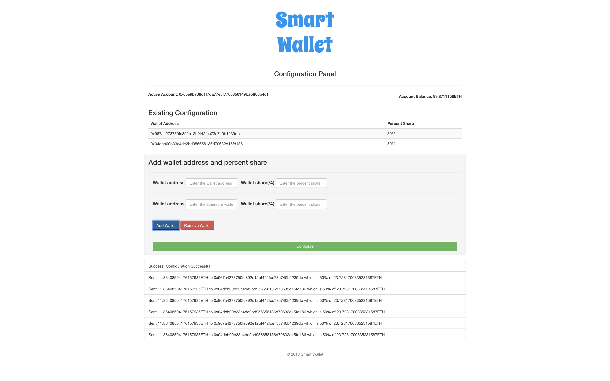

# Smart Wallet

An ethereum based smart contract that splits the amount sent to it. It is configured using a decentralized application.

## Setup
1. Install LTS version of Node.JS. Use [nvm](https://github.com/creationix/nvm) or [tj/n](https://github.com/tj/n) to manage versions of Node.JS.
2. Install [Truffle Framework](https://truffleframework.com). `$> npm i -g truffle`
3. Install [Ganache](https://truffleframework.com/ganache).
4. Install [MetaMask](https://metamask.io)

## Configuration
1. Modify the `port` in `truffle.js`, if required.

## Starting the app
1. `$> npm install`
2. `$> truffle migrate --network ganache`
3. `$> npm run dev`
